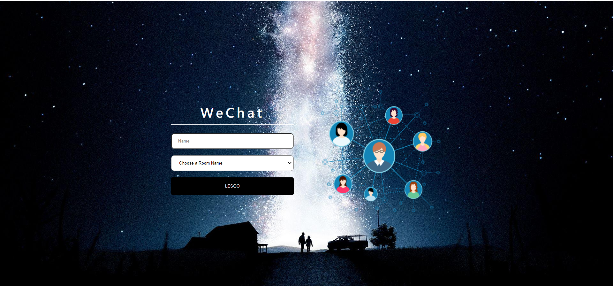

# Real Time Chat Application
  This application built using Node.js, Express, Socket.io.
  

# Features

  <li>Uses Express as the application Framework.</li> 
  <li>Real-time communication between a client and a server using Socket.io.</li>

   
# Installation

### Running Locally

Make sure you have Node.js and npm install.

  1. Clone or Download the repository 
    <pre>git clone https://github.com/batuhaniskr/real-time-chat-application.git
    $ cd Real-Time-Chat-Application</pre>
  2. Install Dependencies
      <pre>npm install</pre>
  
  4. Start the Application
     <pre>npm start</pre>
  Application runs from localhost:3000.
      

 ## Sockets
    
   Having an active connection opened between the client and the server so client can send and receive data. This allows             real-time communication using TCP sockets. This is made possible by Socket.io.

   The client starts by connecting to the server through a socket(maybe also assigned to a specific namespace). Once connections is successful, client and server can emit and listen to events. 

    
  
