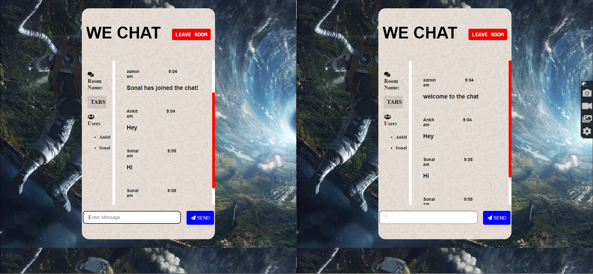

# Real Time Chat Application
  This application built using Node.js, Express, Socket.io.
  

# [LIVE LINK](https://real-time-wechat-application.herokuapp.com/)

# Features

  <li>Uses Express as the application Framework.</li> 
  <li>Real-time communication between a client and a server using Socket.io.</li>

   
# Installation

### Running Locally

Make sure you have Node.js and npm install.

  1. Clone or Download the repository 
    <pre>git clone https://github.com/antimatter007/WeChat.git
    $ cd WeChat</pre>
  2. Install Dependencies
      <pre>npm install</pre>
  
  4. Start the Application
     <pre>npm start</pre>
  Application runs from localhost:3000.

    
  
